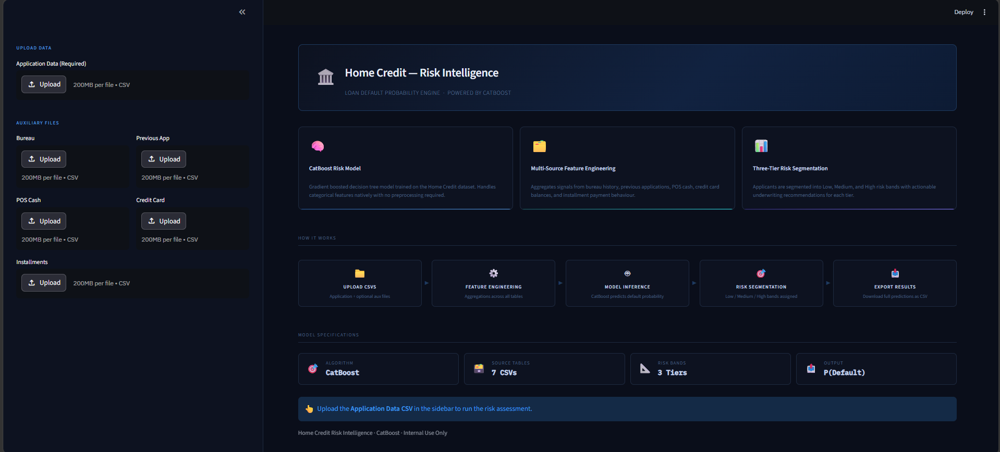
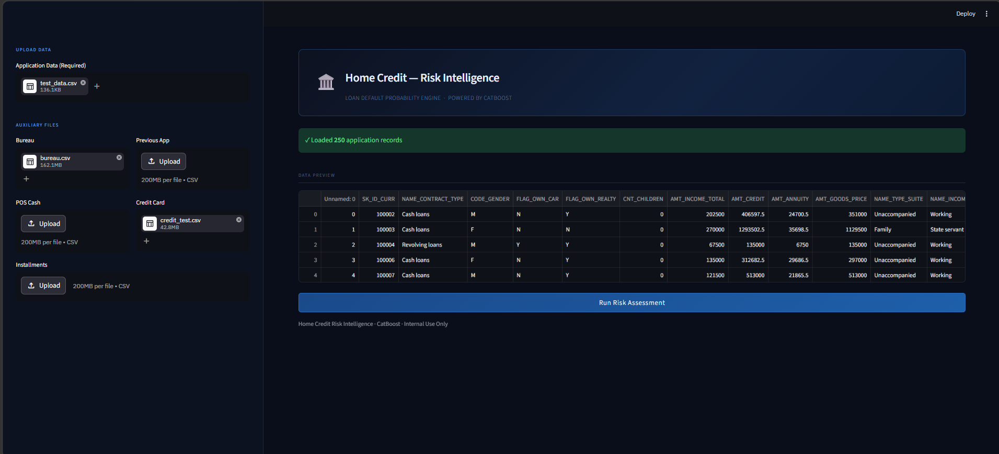
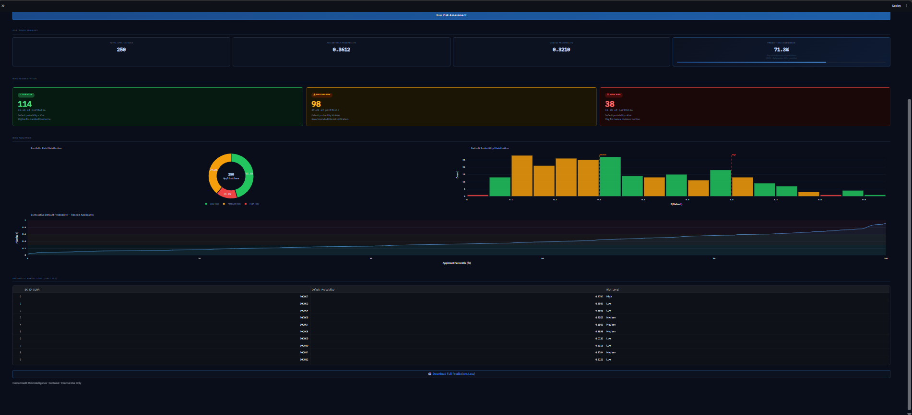
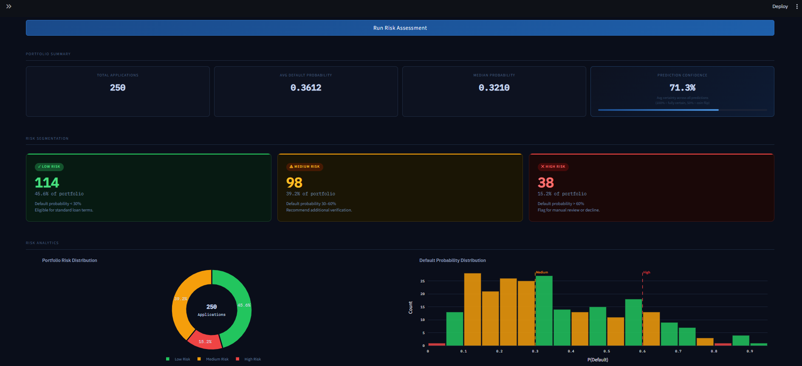
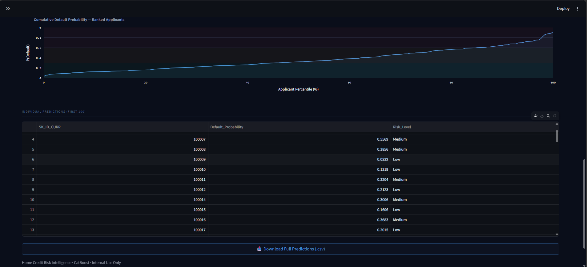

# 🏛️ Home Credit — Loan Default Predictor

> **End-to-End Machine Learning System** — Binary Classification with CatBoost + FastAPI Backend + Streamlit Frontend


---

## 📌 Project Overview

Financial institutions face significant risk from loan defaults, making accurate credit risk assessment critical for sustainable lending. This project builds an ML system that predicts **whether a loan applicant will default** — using 209 engineered features derived from 7 relational data sources covering application details, credit bureau history, previous loans, and payment behavior.

The system is fully deployed via a **FastAPI REST backend** and an interactive **Streamlit web dashboard**, making it ready for real-world credit risk or operational integration.

---

## 🗂️ Table of Contents

- [Problem Statement](#-problem-statement)
- [Dataset](#-dataset)
- [Project Architecture](#-project-architecture)
- [Notebooks & Modeling Workflow](#-notebooks--modeling-workflow)
- [Model Pipeline Design](#-model-pipeline-design)
- [API Reference](#-api-reference)
- [Streamlit UI](#-streamlit-ui)
- [Tech Stack](#-tech-stack)
- [Project Structure](#-project-structure)
- [Setup & Run](#-setup--run)
- [Results Summary](#-results-summary)
- [Key Learnings](#-key-learnings)

---

## 🎯 Problem Statement

**Goal:** Predict the probability of a loan applicant defaulting using administrative, financial, and behavioral features — collected at the time of application.

**Why it matters:**
- Enables proactive **credit risk management** and **portfolio monitoring**
- Helps lenders flag high-risk applicants early before approval
- Supports underwriting teams with data-driven default probability scores
- Provides actionable risk tier segmentation for loan operations

---

## 📊 Dataset

| Property | Detail |
|---|---|
| **Primary File** | `application_train.csv` |
| **Records** | ~300,000 loan applicants |
| **Source Tables** | 7 relational CSVs |
| **Raw Features** | 122 application features |
| **Engineered Features** | 209 total (192 numeric + 17 categorical) |
| **Target** | `TARGET` — 1 = Defaulted, 0 = Repaid |
| **Class Imbalance** | ~8% positive class (default) |
| **Source** | [Home Credit Default Risk — Kaggle](https://www.kaggle.com/c/home-credit-default-risk/data) |

### Data Sources

| File | Description |
|---|---|
| `application_train.csv` | Primary applicant data — demographics, financials, employment |
| `bureau.csv` | Credit bureau records from other institutions |
| `bureau_balance.csv` | Monthly balance history for bureau credits |
| `previous_application.csv` | Past Home Credit loan applications |
| `POS_CASH_balance.csv` | Monthly POS and cash loan balance snapshots |
| `installments_payments.csv` | Repayment history on previous Home Credit loans |
| `credit_card_balance.csv` | Monthly credit card balance and payment data |

---

## 🏗️ Project Architecture

```
7 Relational CSVs
        │
        ▼
┌─────────────────────────────────────────┐
│       Exploratory Data Analysis          │
│  EDA and Model Evaluation.ipynb          │
│  • Class imbalance analysis              │
│  • Missing value heatmaps by group       │
│  • EXT_SOURCE distribution plots         │
│  • Feature importance (CatBoost)         │
│  • ROC-AUC, confusion matrix, PR curve   │
└─────────────┬───────────────────────────┘
              │
              ▼
       Feature Engineering
         (train.py)
    6 modular feature groups
    209 engineered features
              │
              ▼
       CatBoost Classifier
    ColumnTransformer Pipeline
    Serialized artifacts → artifacts/
              │
              ▼
        app.py (FastAPI)
        POST /predict
        POST /predict_batch
              │
              ▼
        streamlit_app.py (Streamlit UI)
```

---

## 📓 Notebooks & Modeling Workflow

### 1. `EDA and Model Evaluation.ipynb` — Exploratory Analysis & Evaluation

**Contents:**
- Dataset shape and class imbalance analysis (~8% default rate)
- Missing value heatmaps broken down by feature group
- EXT_SOURCE score distribution plots (key external credit signals)
- Feature importance charts from the trained CatBoost model
- ROC-AUC curve and confusion matrix on hold-out set
- Precision-Recall tradeoff analysis for threshold selection

---

### 2. `train.py` — Full Training Pipeline

**Objective:** Engineer 209 features from 7 tables, fit preprocessing, and train CatBoost with early stopping.

**Feature engineering modules:**

| Module | Key Signals |
|---|---|
| Application | Credit-to-income ratio, annuity ratio, EXT_SOURCE aggregates (mean/std/product), employment-to-age ratio, document count |
| Bureau Balance | Overdue status counts (DPD 1–5), overdue ratio, serious delinquency ratio |
| Bureau | Active/closed credit counts, debt-to-credit leverage, credit age, bureau overdue max/mean |
| Previous Applications | Approval/refusal rates, application-vs-credit diff, days since last decision |
| POS Cash | DPD flag rate, completed contract ratio, unique previous loan count |
| Credit Card | Credit utilisation (balance/limit), card DPD max/mean |
| Installments | Payment delay (days), late payment rate, payment-to-instalment ratio |

**CatBoost configuration:**
```python
CatBoostClassifier(
    iterations=2000,
    learning_rate=0.03,
    depth=5,
    loss_function='Logloss',
    eval_metric='AUC',
    l2_leaf_reg=15,
    random_seed=42,
    early_stopping_rounds=100
)
```

---

## 🔧 Model Pipeline Design

The production model is saved as a set of **version-locked artifacts** — input goes in raw, predictions come out. No separate preprocessing step at inference time.

### Inference Pipeline
```
Raw Input CSV
    └─► LoanDefaultPredictor (predictor.py)
            ├─ Load feature_order.pkl      → align columns
            ├─ Load preprocessor.pkl       → ColumnTransformer
            │       ├─ SimpleImputer       → [numeric columns]
            │       └─ TargetEncoder       → [categorical columns]
            └─ Load model.cbm              → CatBoost model
    └─► default_probability (float, 0–1)
    └─► prediction (0 or 1) + Risk Tier
```

### Risk Segmentation
```
P(Default) < 30%   → ✅ Low Risk    — Standard loan terms
P(Default) 30–60%  → ⚠️ Medium Risk — Additional verification
P(Default) > 60%   → ❌ High Risk   — Manual review or decline
```

---

## 🚀 API Reference

The FastAPI backend exposes prediction endpoints for both single and batch workflows.

**Start the API:**
```bash
uvicorn app:app --host 0.0.0.0 --port 8000
```

### `POST /predict`

Upload a CSV file of applicants → returns default probabilities and predictions.

**Request:**
```bash
curl -X POST http://localhost:8000/predict \
  -F "file=@application_test.csv"
```

**Response:**
```json
[
  {
    "SK_ID_CURR": 100001,
    "default_probability": 0.23,
    "will_default": 0
  },
  {
    "SK_ID_CURR": 100002,
    "default_probability": 0.71,
    "will_default": 1
  }
]
```

### `POST /predict_batch`

Alias for `/predict` for explicit batch workflow clarity.

Interactive Swagger docs available at: **`http://localhost:8000/docs`**

---

## 🖥️ Streamlit UI

**Start the UI (after the API is running):**
```bash
streamlit run streamlit_app.py
```

**Features:**
- **Landing state:** Feature pipeline overview, model architecture, performance specs
- **After upload:** Portfolio summary metrics, three-tier risk segmentation cards
- Plotly donut chart of risk distribution + probability histogram with tier thresholds
- Cumulative default curve for portfolio analysis
- Scrollable predictions table with per-applicant risk labels
- CSV download of full prediction results
- Dark-themed UI with IBM Plex Sans typography

**Label mappings displayed to user:**

| Prediction | Label | Recommendation |
|---|---|---|
| 0 (P < 30%) | ✅ Low Risk | Eligible for standard loan terms |
| 0/1 (P 30–60%) | ⚠️ Medium Risk | Recommend additional verification |
| 1 (P > 60%) | ❌ High Risk | Flag for manual review or decline |

---

## 🖼️ Application Screenshots

### Landing Page — Model Overview


### Prediction Page — Upload Overview


### Risk Segmentation — Three-Tier Portfolio View


### Risk Analytics — Donut Chart & Probability Distribution


### Individual Predictions Table


---

## 🛠️ Tech Stack

| Layer | Technology |
|---|---|
| Data Processing | `pandas`, `numpy` |
| ML Model | `catboost` |
| Feature Encoding | `TargetEncoder`, `SimpleImputer`, `ColumnTransformer` |
| Model Serialization | `joblib`, `.cbm` (CatBoost native) |
| API Backend | `FastAPI`, `uvicorn`, `python-multipart` |
| Frontend | `Streamlit`, `Plotly` |
| EDA | `matplotlib`, `seaborn` |

---

## 📁 Project Structure

```
home-credit-loan-default-predictor/
│
├── 📓 EDA and Model Evaluation.ipynb      # EDA + model evaluation notebook
│
├── 🐍 train.py                            # Feature engineering + training pipeline
├── 🐍 predictor.py                        # LoanDefaultPredictor inference class
├── 🐍 app.py                              # FastAPI REST API server
├── 🐍 streamlit_app.py                    # Streamlit web dashboard
├── 🐍 predict.py                          # CLI batch prediction script
│
├── 💾 artifacts/
│   ├── model.cbm                          # Serialized CatBoost model (~1.3 MB)
│   ├── preprocessor.pkl                   # Fitted ColumnTransformer
│   ├── feature_order.pkl                  # Ordered feature list for inference
│   └── metadata.json                      # Column lists, threshold, config
│
├── 📊 data/                               # ⚠️ CSVs not included (too large — download from Kaggle)
│   ├── application_train.csv              # ~300K rows, 122 features
│   ├── bureau.csv                         # Credit bureau records
│   ├── bureau_balance.csv                 # Bureau monthly balances
│   ├── previous_application.csv           # Past HC applications
│   ├── POS_CASH_balance.csv               # POS and cash loan snapshots
│   ├── installments_payments.csv          # Repayment history
│   └── credit_card_balance.csv            # Credit card monthly data
│
├── 📋 requirements.txt                    # Python dependencies
├── 📋 Dataset Description.pdf            # Official feature dictionary
└── 📸 screenshots/                        # UI screenshots for README
```

---

## ⚙️ Setup & Run

### 1. Clone the repository
```bash
git clone https://github.com/ENGABHAY/home-credit-loan-default-predictor.git
cd home-credit-loan-default-predictor
```

### 2. Create a virtual environment
```bash
python -m venv venv
venv\Scripts\activate           # Windows
source venv/bin/activate        # macOS/Linux
```

### 3. Install dependencies
```bash
pip install -r requirements.txt
```

### 4. Download the dataset

Download all 7 CSV files from the [Home Credit Default Risk](https://www.kaggle.com/c/home-credit-default-risk/data) Kaggle competition and place them into the `data/` folder:

```
data/
  application_train.csv
  bureau.csv
  bureau_balance.csv
  previous_application.csv
  POS_CASH_balance.csv
  installments_payments.csv
  credit_card_balance.csv
```

### 5. Train the model
```bash
python train.py
# Artifacts saved to: artifacts/
```

### 6. Start the FastAPI backend
```bash
uvicorn app:app --host 0.0.0.0 --port 8000
# API running at: http://localhost:8000
# Swagger UI at:  http://localhost:8000/docs
```

### 7. Start the Streamlit dashboard (new terminal)
```bash
streamlit run streamlit_app.py
# UI running at: http://localhost:8501
```

### 8. CLI batch prediction (optional)
```bash
python predict.py data/application_test.csv \
    data/bureau.csv \
    data/bureau_balance.csv \
    data/previous_application.csv \
    data/POS_CASH_balance.csv \
    data/installments_payments.csv \
    data/credit_card_balance.csv
# Outputs: predictions.csv
```

> ⚠️ The Streamlit dashboard calls the FastAPI backend at `http://127.0.0.1:8000` — both must be running simultaneously.

---

## 📈 Results Summary

| Model | Task | Algorithm | Key Config |
|---|---|---|---|
| Loan Default Classifier | Binary Default Prediction | CatBoost | 2000 iterations, lr=0.03, depth=5, L2=15, early stopping |
| Preprocessing Pipeline | Imputation + Encoding | ColumnTransformer | SimpleImputer + TargetEncoder, 209 features |
| Risk Segmentation | 3-Tier Portfolio Bucketing | Threshold-based | <30% Low, 30–60% Medium, >60% High |

The production model uses version-locked artifacts — **zero data leakage**, production-safe, single `.predict()` call at inference.

---

## 💡 Key Learnings

- **Multi-table feature engineering** across 7 relational sources is where most of the predictive signal lives — raw application features alone significantly underperform the full 209-feature set.
- **CatBoost's native categorical handling** eliminates the need for one-hot encoding on high-cardinality columns like `OCCUPATION_TYPE` and `ORGANIZATION_TYPE`, reducing preprocessing complexity.
- **Class imbalance (~8% default rate)** is handled via automatic `scale_pos_weight`-equivalent class weighting in CatBoost, preserving dataset integrity without resampling.
- **Artifact-first design** (separate `model.cbm`, `preprocessor.pkl`, `feature_order.pkl`, `metadata.json`) makes model versioning and A/B testing trivial — swap one file to compare iterations.
- Separating the **API layer (FastAPI)** from the **UI layer (Streamlit)** makes the system modular — the API can serve any frontend, mobile app, or downstream risk system independently.
- **EXT_SOURCE features** (external credit scores) are consistently the top predictors — aggregating them as mean, std, and product captures more signal than using them individually.

---

## 🧩 Extending the Project

- **SHAP explanations** — `pip install shap` and call `shap.TreeExplainer(model)` for per-applicant feature attribution
- **Hyperparameter tuning** — use `optuna` with `CatBoostClassifier` for AUC-optimised search
- **Threshold calibration** — adjust the 0.5 default threshold via `predict(threshold=0.35)` for higher recall
- **Docker deployment** — wrap `app.py` in a Dockerfile for containerised API serving
- **Model versioning** — swap `artifacts/model.cbm` to compare model iterations without code changes

---

## 🤝 Contributing

Pull requests are welcome. For major changes, please open an issue first to discuss what you'd like to change.

---

<div align="center">
  <strong>Built with Python · CatBoost · Scikit-Learn · FastAPI · Streamlit · Plotly</strong>
</div>

---

📄 License

This project is for educational and personal portfolio purposes.